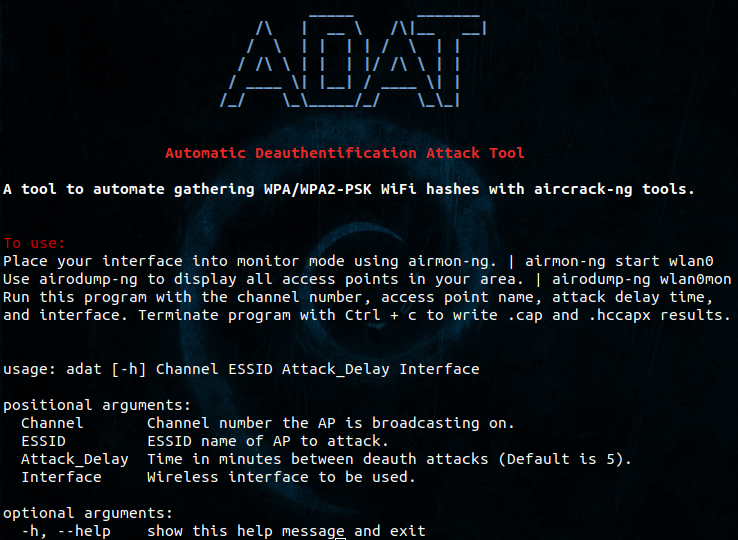

# adat
Automatic Deauthentification Attack Tool<br /> 
A tool to automate the gathering of WPA/WPA2-PSK WiFi hashes with aircrack-ng tools. <br />


## Requirements
Linux (tested on Kali), Python 3.6+, pip, and the Aircrack-ng tool suite.
```
pip install -r requirements.txt
```


## Usage
Runs airodump-ng to start capturing traffic associated with the access point. <br />
Then it parses the airodump-ng log file every n minutes and sends 5 <br />
deauthentification packet clusters with aireplay-ng from every station that <br />
has been associated with the access point. Then it renames the capture file, <br />
creates a Hashcat v3.6+ file, and removes all other log files. <br />
<br />

